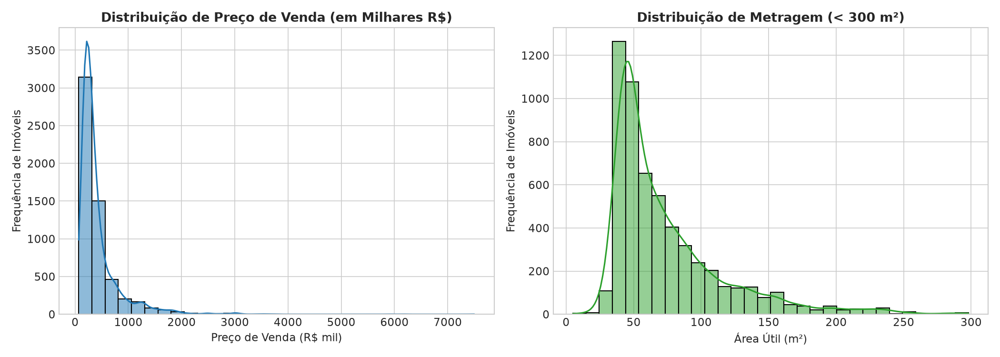
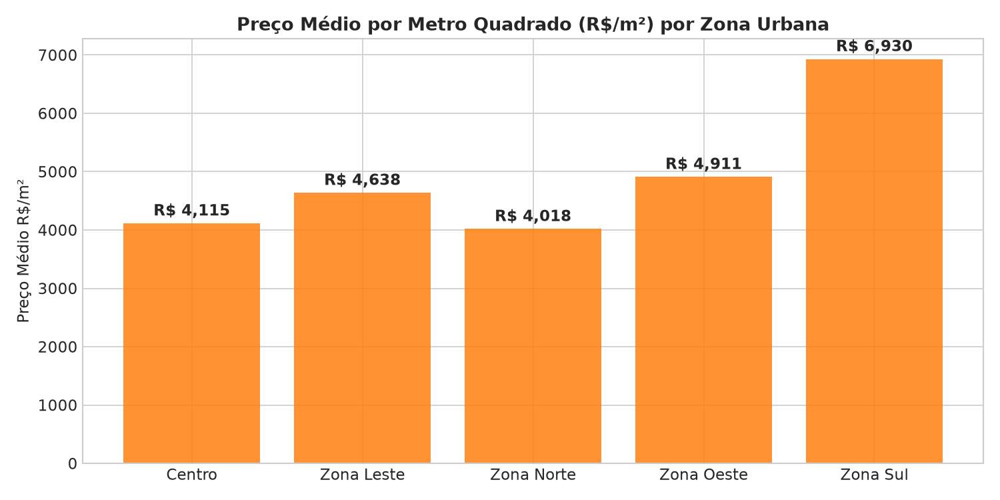
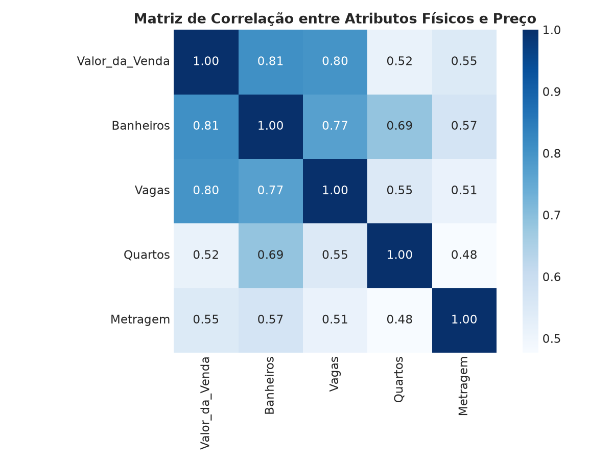
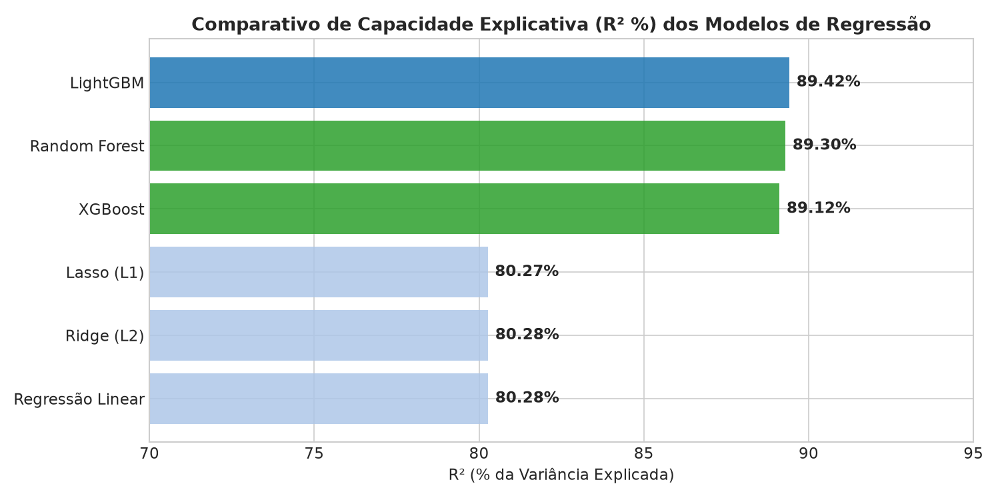

# 📊 Análise Exploratória de Dados (EDA) & Interpretação de Modelos de Regressão
**Projeto**: Previsão de Preço de Venda de Imóveis (Apartamentos) em Ribeirão Preto - SP  
**Autor**: Equipe de Data Science & Machine Learning  

---

## 🎯 1. Visão Geral do Projeto e Conjunto de Dados

Este projeto visa construir um pipeline preditivo de Machine Learning para estimar o **Valor de Venda (`Valor_da_Venda`)** de imóveis residenciais (apartamentos) na cidade de Ribeirão Preto.

### 📐 Resumo do Dataset
- **Total de Registros**: 5.712 apartamentos analisados.
- **Total de Atributos**: 8 variáveis (identificadores, localização física e atributos estruturais).
- **Integridade dos Dados**: 0 valores ausentes/nulos (base 100% preenchida).
- **Abrangência Geográfica**: 153 bairros categorizados em 5 zonas urbanas da cidade (*Zona Norte, Zona Sul, Zona Leste, Zona Oeste e Centro*).

---

## 🔍 2. Análise Exploratória de Dados (EDA)

### A. Estatísticas Descritivas e Assimetria (Skewness) dos Atributos Numéricos

| Atributo | Média | Mediana (p50) | Desvio Padrão | Mínimo | Percentil 25% | Percentil 75% | Máximo | **Skewness (Assimetria)** |
| :--- | :--- | :--- | :--- | :--- | :--- | :--- | :--- | :--- |
| **`Valor_da_Venda` (R$)** | `R$ 425.975,40` | `R$ 290.000,00` | `R$ 416.421,80` | `R$ 69.000,00` | `R$ 200.000,00` | `R$ 460.000,00` | `R$ 7.500.000,00` | **`+4,3548`** *(Forte Assimetria Positiva)* |
| **`Metragem` (\(m^2\))** | `77,39 m²` | `59,00 m²` | `74,12 m²` | `5,00 m²` | `45,00 m²` | `89,00 m²` | `4.151,00 m²` | **`+30,0127`** *(Extrema Assimetria Positiva)* |
| **`Vagas`** | `1,34` | `1,00` | `0,78` | `0` | `1` | `2` | `10` | **`+2,5611`** *(Forte Assimetria Positiva)* |
| **`Banheiros`** | `1,76` | `1,00` | `1,07` | `1` | `1` | `2` | `10` | **`+1,5781`** *(Moderada/Forte Assimetria)* |
| **`Quartos`** | `2,22` | `2,00` | `0,73` | `1` | `2` | `3` | `9` | **`+0,4697`** *(Leve Assimetria Positiva)* |

---

### B. Visualização das Distribuições Principais

#### 💼 Interpretação para a Equipe de Negócio:
1. **Comportamento do Preço de Venda**:
   - A maioria esmagadora do inventário de apartamentos em Ribeirão Preto está concentrada na faixa de **R$ 150 mil a R$ 450 mil** (imóveis de padrão médio/econômico).
   - Existe um **segmento de luxo (cauda longa)** com unidades que chegam a R$ 7,5 milhões. Isso indica que a plataforma comercial deve categorizar produtos em duas linhas distintas (*Standard* vs *High-End / Prime*) para evitar precificações distorcidas.
2. **Distribuição da Metragem**:
   - O núcleo do mercado consumidor busca apartamentos compactos/médios de **45 \(m^2\) a 90 \(m^2\)**.
   - Imóveis com metragens superiores a 250 \(m^2\) são raros e exigem tratamento diferenciado por modelos não-lineares.

---

### C. Análise Geográfica por Zona Urbana

| Zona Urbana | Quantidade de Imóveis | Preço Médio (R$) | Preço Mediano (R$) | Metragem Média (\(m^2\)) | Preço Médio do \(m^2\) (R$/\(m^2\)) |
| :--- | :--- | :--- | :--- | :--- | :--- |
| **Zona Sul** | 2.119 (37,1%) | `R$ 659.733,86` | `R$ 470.000,00` | `92,38 m²` | `R$ 6.930,33` |
| **Centro** | 668 (11,7%) | `R$ 415.461,96` | `R$ 371.500,00` | **`112,02 m²`** | `R$ 4.114,89` |
| **Zona Leste** | 1.629 (28,5%) | `R$ 279.670,32` | `R$ 250.000,00` | `61,82 m²` | `R$ 4.638,26` |
| **Zona Oeste** | 532 (9,3%) | `R$ 275.096,85` | `R$ 243.900,00` | `59,23 m²` | `R$ 4.911,47` |
| **Zona Norte** | 764 (13,4%) | `R$ 203.838,30` | `R$ 180.000,00` | `51,41 m²` | `R$ 4.018,45` |

---

#### 💼 Interpretação para a Equipe de Negócio:
- **Zona Sul (Polo de Valorização)**: Apresenta o maior ticket médio por metro quadrado (**R$ 6.930/m²**), sendo 72% mais cara por \(m^2\) do que a Zona Norte (**R$ 4.018/m²**). Investimentos de reforma ou lançamento imobiliário na Zona Sul geram a maior margem bruta absoluta por metro construído.
- **Centro (Oportunidade de Repaginação/Retrofit)**: Possui a maior área útil média por imóvel (112 \(m^2\)), mas um valor por \(m^2\) moderado (R$ 4.115/m²). Aponta grande potencial para projetos de modernização e *retrofit*.

---

### D. Matriz de Correlação entre Atributos Físicos e Preço

#### 💼 Interpretação para a Equipe de Negócio:
- **Vagas de Garagem (\(r = +0,79\)) e Banheiros (\(r = +0,79\))**: São os **maiores aceleradores de valor comercial**. Na prática, compradores de médio/alto padrão priorizam ter pelo menos 2 vagas e 2 banheiros (ou suítes).
- **Metragem (\(r = +0,48\)) vs Vagas (\(r = +0,79\))**: Ter uma vaga extra agrega mais valor relativo ao preço final do que apenas expandir a área útil privativa sem vaga associada.

---

## 🔬 3. Comparativo e Desempenho dos Modelos de Regressão

| Modelo | \(R^2\) (Variância Explicada) | MAE (Erro Médio Absoluto) | MedAE (Mediana do Erro) | RMSE (Erro Quadrático) |
| :--- | :--- | :--- | :--- | :--- |
| **LightGBM** 🏆 | **`0,8942` (89,42%)** | **`R$ 83.548,00`** | `R$ 51.015,63` | **`R$ 139.241,28`** |
| **Random Forest** | **`0,8930` (89,30%)** | `R$ 83.771,54` | **`R$ 45.230,13`** | `R$ 140.043,21` |
| **XGBoost** | **`0,8912` (89,12%)** | `R$ 81.916,42` | `R$ 46.470,42` | `R$ 141.171,18` |
| **Regressão Linear (OLS)** | `0,8028` (80,28%) | `R$ 112.782,58` | `R$ 66.757,70` | `R$ 190.084,27` |
| **Regressão Ridge (L2)** | `0,8028` (80,28%) | `R$ 112.704,59` | `R$ 67.056,53` | `R$ 190.094,58` |
| **Regressão Lasso (L1)** | `0,8027` (80,27%) | `R$ 112.722,27` | `R$ 67.046,02` | `R$ 190.130,40` |

---

### 📘 Interpretação para a Equipe de Negócio

1. **Modelos Não-Lineares / Gradient Boosting (LightGBM / Random Forest / XGBoost)**:
   - **Performance**: Explicam **89,4% da precificação total do mercado**, reduzindo a margem de erro mediana para cerca de **R$ 45 mil - R$ 51 mil**.
   - **Por que são os melhores?**: Eles capturam automaticamente regras de negócio complexas, como: *"Um imóvel de 100 m² na Zona Sul vale proporcionalmente muito mais do que um imóvel de 100 m² na Zona Norte"*.
   - **Recomendação de Uso**: Devem ser utilizados como o **motor principal da API de Precificação Automática (AVM - Automated Valuation Model)** no portal imobiliário.

2. **Modelos Lineares (Regressão Linear / Ridge / Lasso)**:
   - **Performance**: Explicam **80,3%** da variância dos preços.
   - **Por que ainda são úteis?**: Fornecem regras diretas em reais (ex: *"Cada vaga adicional acrescenta aproximadamente R$ 251,8 mil ao valor estimado no modelo linear"*).
   - **Recomendação de Uso**: Devem ser usados em **relatórios de consultoria técnica**, pois permitem explicar de forma transparente aos proprietários exatamente quanto cada atributo adiciona ao valor do imóvel.

---

## 🚀 4. Recomendações Estratégicas para o Negócio

1. **Segmentação da Ferramenta de Avaliação**:
   - Imóveis na Zona Sul acima de R$ 1,5 milhão devem ter uma camada extra de validação de modelo não-linear para capturar acabamentos de luxo.
2. **Estratégia de Captação de Imóveis**:
   - Priorizar captação de apartamentos com 2+ vagas e 2+ banheiros na Zona Sul, por apresentarem a menor liquidez de tempo e o maior valor agregado por transação.
